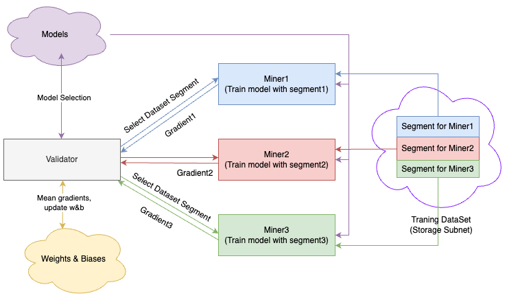
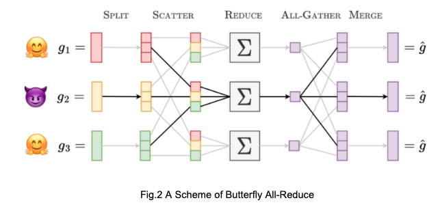

<div align="center">

# **Bittensor Map Reduce** <!-- omit in toc -->
[](https://discord.gg/bittensor)
[](https://opensource.org/licenses/MIT) 

---

### The Incentivized Internet <!-- omit in toc -->

[Discord](https://discord.gg/bittensor) • [Network](https://taostats.io/) • [Research](https://bittensor.com/whitepaper)

</div>

---

A broadcast subnet leverages the bandwidth of multiple peers to transfer large data from point to A to multiple point Bs without needing to leverage large quantities of your own upload. The concept is simple, a large file D can be split into multiple chunks and sent to N intermediate peers (usually with redundancy) and then forwarded onward to B additional endpoints in an N by B full bipartite fashion. The inverse operation is also valuable, where data DxB large data files can be aggregated from B peers by leveraging the bandwidth of N intermediaries. 

In the forward 'map' operation a file D is broken into chunks and split across the N peers each of whom then forwards their chunk to B endpoints allowing each downloading peer to recieve the full file of size D with the sending peer needing an upload of only size D. The backward operation, 'reduce', acts in reverse, the K receiving peers fan out their response data D in chunks to the N intermediary peers who then aggregate the chunks from each other and finally send the sum of total chunks back to the sending peer A. 

The map-reduce cycle is essential for reducing the bandwidth by a factor of K on the running peers which is essential for the training of machine learning models in a distributed setting. This template is a protoype for incentivizing the speed at which this operation can take place by validating both the consistency and operation speed of a map-reduce.    

---
# Data Flow



- Map the training data:
Validators broadcast a request for gradient computation to Miners. Validators determine training dataset for each miner based on their capacity of computational resources.

- Data Processing & Response:
Miners process the request by training given data on datasets on the storage subnet.
Miners then send their computed gradients back to the Validators.

- Reduce the gradients:
Validators receive gradients from Miners and begin the verification process.
False gradients or attacks are identified and handled by reducing points of the miners.
The average gradient, as computed by the validator, is a weighted sum of the gradients submitted by the miners. Each miner’s gradient is multiplied by a corresponding weight, or point, assigned to that miner. 
The sum of all miner points equals 1.

avg.gradient = sum(gradient[i] * point[i])

- Update the model:
Validators update the model with the average gradient.




# Running the template
Before running the template you will need to attain a subnetwork on either Bittensor's main network, test network, or your own staging network. To create subnetworks on each of these subnets follow the instructions in files below:

- `docs/running_on_staging.md`
- `docs/running_on_testnet.md`
- `docs/running_on_mainnet.md`

</div>

---

# Installation
This repository requires python3.8 or higher. To install, simply clone this repository and install the requirements.
```bash
git clone https://github.com/unconst/map-reduce-subnet.git
cd map-reduce-subnet
python -m pip install -r requirements.txt
python -m pip install -e .
```

</div>

---

Once you have installed this repo and attained your subnet via the instructions in the nested docs (staging, testing, or main) you can run the miner and validator with the following commands.
```bash
# To run the miner
python -m neurons/miner.py 
    --netuid <your netuid>  # Must be attained by following the instructions in the docs/running_on_*.md files
    --subtensor.chain_endpoint <your chain url>  # Must be attained by following the instructions in the docs/running_on_*.md files
    --wallet.name <your miner wallet> # Must be created using the bittensor-cli
    --wallet.hotkey <your validator hotkey> # Must be created using the bittensor-cli
    --logging.debug # Run in debug mode, alternatively --logging.trace for trace mode

# To run the validator
python -m neurons/validator.py 
    --netuid <your netuid> # Must be attained by following the instructions in the docs/running_on_*.md files
    --subtensor.chain_endpoint <your chain url> # Must be attained by following the instructions in the docs/running_on_*.md files
    --wallet.name <your validator wallet>  # Must be created using the bittensor-cli
    --wallet.hotkey <your validator hotkey> # Must be created using the bittensor-cli
    --logging.debug # Run in debug mode, alternatively --logging.trace for trace mode
```

</div>

---

# Updating the template
The code contains detailed documentation on how to update the template. Please read the documentation in each of the files to understand how to update the template. There are multiple TODOs in each of the files which you should read and update.

</div>

---

## License
This repository is licensed under the MIT License.
```text
# The MIT License (MIT)
# Copyright © 2023 Yuma Rao

# Permission is hereby granted, free of charge, to any person obtaining a copy of this software and associated
# documentation files (the “Software”), to deal in the Software without restriction, including without limitation
# the rights to use, copy, modify, merge, publish, distribute, sublicense, and/or sell copies of the Software,
# and to permit persons to whom the Software is furnished to do so, subject to the following conditions:

# The above copyright notice and this permission notice shall be included in all copies or substantial portions of
# the Software.

# THE SOFTWARE IS PROVIDED “AS IS”, WITHOUT WARRANTY OF ANY KIND, EXPRESS OR IMPLIED, INCLUDING BUT NOT LIMITED TO
# THE WARRANTIES OF MERCHANTABILITY, FITNESS FOR A PARTICULAR PURPOSE AND NONINFRINGEMENT. IN NO EVENT SHALL
# THE AUTHORS OR COPYRIGHT HOLDERS BE LIABLE FOR ANY CLAIM, DAMAGES OR OTHER LIABILITY, WHETHER IN AN ACTION
# OF CONTRACT, TORT OR OTHERWISE, ARISING FROM, OUT OF OR IN CONNECTION WITH THE SOFTWARE OR THE USE OR OTHER
# DEALINGS IN THE SOFTWARE.
```
